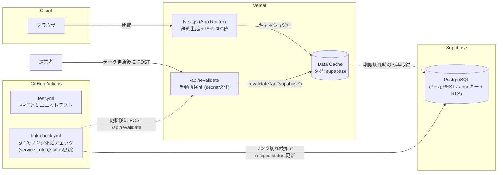

# システム構成・ディレクトリ構成

開発に参加する人（AIエージェント含む）が全体像を素早く把握するためのドキュメント。
詳細な仕様は [docs/mvp/spec.md](./mvp/spec.md)、コーディング規約は
[docs/CODING_CONVENTION.md](./CODING_CONVENTION.md) を参照。

## システム構成

Next.js（App Router）を Vercel にデプロイし、データは Supabase（PostgreSQL + PostgREST）から取得する。
閲覧リクエストは原則 Vercel のキャッシュから返し、DBへは ISR の再検証時にしかアクセスしない
（Supabase Free の休止対策。spec §6）。



ポイント:

- **ISR**: 全ページが `export const revalidate = 300`（5分）。Supabase への fetch はすべて
  キャッシュタグ `supabase` 付きで Data Cache に載る（`src/lib/supabase.ts`）。
- **手動再検証**: DB更新を5分待たずに反映したいときは
  `POST /api/revalidate?secret=<REVALIDATE_SECRET>` でタグごと無効化する。
- **フォールバック**: Supabase 未設定・休止・障害時もサイト表示は継続する。
  データ取得層（`src/lib/data.ts`）が失敗時に空配列/nullを返す（spec §6）。
- **リンク死活チェック**: `link-check.yml` が週1で `scripts/check-links.mjs` を実行し、
  外部レシピの 404/410 を検知して `recipes.status` を更新する（README参照）。

## ディレクトリ構成

```
.
├── src/
│   ├── app/          # ルーティングとページ（Next.js App Router）
│   ├── components/   # UI部品（描画とURLクエリ同期などUI都合のみ）
│   └── lib/          # データ取得・型・ロジック（純粋関数）・共通定数
├── supabase/
│   └── migrations/   # DBスキーマのマイグレーション（適用手順は supabase/README.md）
├── scripts/          # CI・運用スクリプト（アプリからは import しない）
├── docs/             # 仕様・規約・本ドキュメント
├── public/           # 静的ファイル（銘柄の商品画像など）
└── .github/workflows/ # CI（test.yml / link-check.yml）
```

### どこに何を置くか（レイヤー分離）

コーディング規約の「レイヤー分離」に従う。新しいコードは以下のいずれかに置く。

| 場所 | 責務 | 例 |
| --- | --- | --- |
| `src/app/` | ルーティング、データ取得の呼び出し、コンポーネントの組み立て。ページから直接DBクエリを書かない | `recipes/[id]/page.tsx` |
| `src/components/` | 描画とUI都合（URLクエリ同期・ローカルstate）のみ。ビジネスロジックを持たない | `recipe-filters.tsx` |
| `src/lib/data.ts` | Supabaseへのクエリを集約。失敗時はフォールバック値を返す | `getRecipes()` |
| `src/lib/supabase.ts` | Supabaseクライアント生成（外部依存のモック境界）、ISR定数 | `getSupabaseClient()` |
| `src/lib/types.ts` | データモデルに対応する型と、型に密接な純粋関数 | `isGlutenFree()` |
| `src/lib/filters.ts` | 絞り込み・変換などの純粋関数（UIから独立、ユニットテスト対象） | `filterRecipes()` |
| `src/lib/`（その他） | サイト定数・メタデータ生成・構造化データ | `site.ts` / `metadata.ts` / `structured-data.ts` |
| `src/**/__tests__/` | Vitest のユニットテスト（対象モジュールの近くに置く） | `lib/__tests__/filters.test.ts` |
| `supabase/migrations/` | スキーマ変更はすべてマイグレーションで管理（手動変更しない） | `20260718164353_initial_schema.sql` |
| `scripts/` | Node単体で動くCI・運用スクリプト。`src/` のモジュールに依存しない | `check-links.mjs` |

## デプロイ・環境

- **Vercel**: main へのマージで本番デプロイ。PRごとにプレビューデプロイが作られる
  （プレビューは robots.txt で全面クロール拒否）。
- **環境変数**: アプリの参照は `src/lib/env.ts` に集約。一覧はREADMEの「環境変数」を参照。
- **CI**: PRごとに `test.yml` がユニットテストを実行し、失敗するとマージできない。
